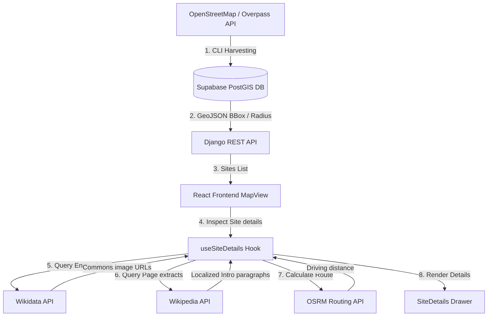

# 🗺️ HistoryVoyage

HistoryVoyage is a geospatial full-stack application designed to explore, search, and map over **29,000 historical and archaeological sites** (castles, ruins, monuments, ancient temples, places of worship, and tombs) across Israel, Greece, and Italy. 

The system leverages **GeoDjango** containerized with Docker, a **PostgreSQL** database hosted on **Supabase** with the **PostGIS** spatial database extension, and an interactive **React + Leaflet** map browser client with multi-tiered Wikidata/Wikipedia translation fallbacks.

---

## 🏗️ Project Architecture

HistoryVoyage is structured as a full-stack monorepo:

```text
historyVoyage/
├── backend/            # GeoDjango REST API & Overpass Seeding Engine
│   ├── config/         # System settings, ASGI/WSGI configs, and URL patterns
│   ├── heritage/       # Models, views, serializers, selectors, and CLI seed commands
│   ├── Dockerfile.dev  # Dev Dockerfile (includes local PROJ, GDAL, and GEOS layers)
│   ├── docker-compose.yml # Container services orchestration (Django + PostgreSQL)
│   └── requirements.txt # Python package requirements
├── frontend/           # React + Vite Interactive Client
│   ├── src/            # Application codebase
│   │   ├── components/ # Leaflet views, drawers, search, and alerts components
│   │   ├── hooks/      # State custom hooks (MapData, SiteDetails, DeepLinks)
│   │   ├── services/   # REST API wrappers (Local Backend, Wikidata, Wikipedia)
│   │   └── utils/      # Haversine distance, OSRM routing, and Wikipedia name matching
│   ├── package.json    # Javascript dependency definitions
│   └── vite.config.js  # Vite bundler parameters
└── README.md           # Master documentation (this file)
```

---

## ⚙️ Core Technical Workflow

The application operates on an asynchronous data harvesting, retrieval, and enhancement loop:



### 1. Data Harvesting & Seeding
A custom Django management command queries OpenStreetMap nodes and closed ways tagged with `historic` values across the target territories. The script parses the raw coordinate sets into PostGIS `Point` geometry nodes and maps category keys to specific icons. 
- **Deduplication**: Resolves duplicate queries using combined primary key caching (`osm_type` + `osm_id`) to perform safe bulk-insert updates.
- **Complexity**: Closed ways (bounding outlines) are stored in a dedicated `boundary` field to draw exact layouts on the map.

### 2. Geographical Queries (PostGIS)
The Django REST Viewset exposes optimized geographical queries:
- **Viewport Bounding Box**: Uses database `location__within` filters to return features inside the map's visible bounds, limiting payload size to the closest 100 features ordered by Wikidata presence.
- **Geographic Radius Search**: Computes coordinates distances on the PostGIS server using `location__distance_lte` to return sites within a given meter radius, ordered by database distance.

### 3. Multi-Tiered Translation & Asset Resolver (Frontend Hooks)
To resolve multilingual naming discrepancies and display rich media summaries, the React frontend runs an asynchronous resolver chain when a site marker is clicked:
1. **Local Backend**: Pulls base metadata from the database (on-the-fly English translation is performed by the backend Django service using `deep_translator` if missing).
2. **Wikidata Claims Lookup**: If a Wikidata ID (e.g. `Q12345`) is present, queries Wikidata for Wikipedia sitelinks and evaluates image claims (property `P18`) to fetch Wikimedia Commons cover image URLs.
3. **Wikipedia Summary Extract**: Queries the local language (Greek/Hebrew/Italian) and English Wikipedia APIs to fetch introduction text abstracts.
4. **Wikipedia Search Fallback**: If no direct sitelink is available, runs a word-intersection heuristic matching query to find the correct article based on title similarity and country tags.

### 4. User Authentication (Supabase)
HistoryVoyage uses Supabase for user authentication (Sign Up / Log In).
- **JWT Tokens**: The React frontend securely stores Supabase session tokens and automatically attaches them to any outgoing requests to the local Django REST API via an interceptor (`apiFetch`).
- **Profile Synchronization**: When a user logs in, the `backendApi.fetchCurrentUser()` endpoint validates the JWT on the Django side and ensures a synced user profile is available in the database.

---

## 🗄️ Spatial Database & Seeding Stats

The production spatial database runs on a remote Supabase Postgres container with PostGIS enabled. 

### Seeding Breakdown
*   **Total Seeded Sites**: `29,795`
*   **Country Distribution**:
    *   🇮🇹 **Italy**: `23,418` sites
    *   🇬🇷 **Greece**: `4,714` sites
    *   🇮🇱 **Israel**: `1,663` sites
*   **Mapped Categories**:
    *   🏺 **Archaeological Sites**: `9,257`
    *   🏚️ **Ruins**: `7,490`
    *   🗽 **Monuments**: `5,085`
    *   🏰 **Castles**: `4,430`
    *   ⛪ **Holy Sites / Places of Worship**: `3,514`
    *   ❓ **Other**: `19`

---

## 🚀 Getting Started

### Prerequisites
*   [Docker Desktop](https://www.docker.com/products/docker-desktop/) (required to spin up Django REST services without manual local builds of GEOS/GDAL spatial libraries)
*   [Node.js (v18+)](https://nodejs.org/) (for the local frontend dev environment)

### 1. Run the GeoDjango Backend
1. Ensure your local Docker daemon is running.
2. Navigate to the `backend/` directory:
   ```bash
   cd backend
   ```
3. Copy the example environment variables file and configure your credentials:
   ```bash
   cp .env.example .env
   ```
4. Build and start the container services:
   ```bash
   docker-compose up --build
   ```
5. The REST API server will start at `http://localhost:8000/`. You can log into the Django Admin at `http://localhost:8000/admin/`.

### 2. Run the React Frontend
1. Navigate to the `frontend/` directory:
   ```bash
   cd ../frontend
   ```
2. Copy the example environment variables file and configure your Supabase credentials:
   ```bash
   cp .env.example .env
   ```
3. Install Javascript dependencies:
   ```bash
   npm install
   ```
4. Start the Vite hot-reloading development server:
   ```bash
   npm run dev
   ```
4. Open your browser and navigate to `http://localhost:5173/` to view the interactive map.

---

## 📡 API Endpoints

### 1. Map Bounding Box Filter
*   **Endpoint**: `GET /api/sites/`
*   **Query Params**: `in_bbox=west,south,east,north` (represented as `min_lng,min_lat,max_lng,max_lat`)
*   **Optional Params**: `limit` (max returns, default 100), `site_type` (e.g. 'castle'), `search` (text search search query)
*   **Example Request**:
    `GET http://localhost:8000/api/sites/?in_bbox=23.70,37.95,23.76,38.00` *(Athens Center)*

### 2. Nearby Radius Search
*   **Endpoint**: `GET /api/sites/nearby/`
*   **Query Params**: 
    *   `lat` (Latitude of center coordinate)
    *   `lng` (Longitude of center coordinate)
    *   `radius` (Distance limit in meters)
*   **Example Request**:
    `GET http://localhost:8000/api/sites/nearby/?lat=31.7683&lng=35.2137&radius=5000` *(Jerusalem 5km radius)*

### 3. Detail View (includes Boundary Outlines)
*   **Endpoint**: `GET /api/sites/<id>/`
*   **Example Request**:
    `GET http://localhost:8000/api/sites/123/`
